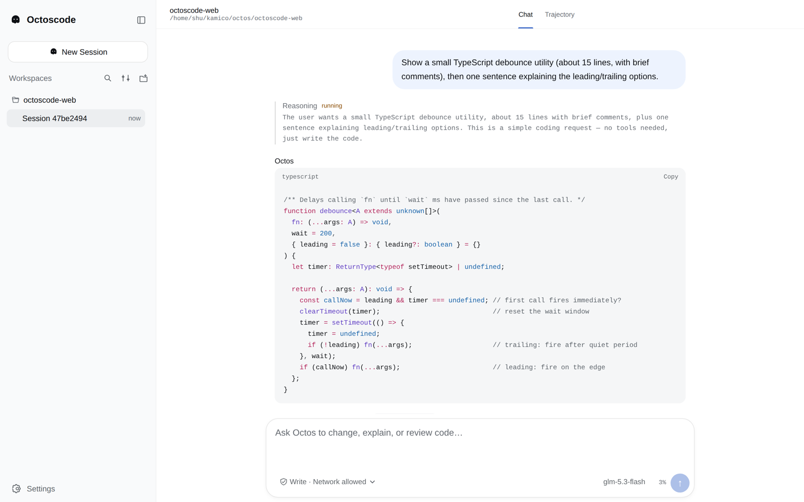
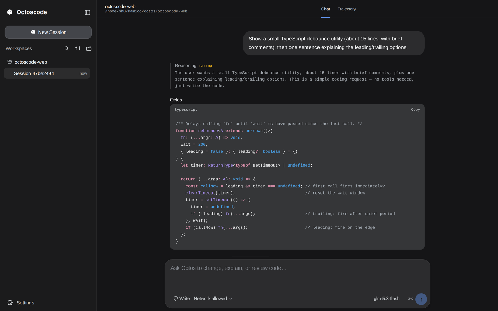

<div align="center">

# octoscode-web

**Octoscode, in the browser.**

A focused Web client for the Octos coding UI Protocol.

[](https://github.com/octos-org/octoscode-web/actions/workflows/ci.yml)
[](https://github.com/octos-org/octoscode-web/releases)
[](LICENSE)

[Get started](docs/getting-started.md) · [Documentation](docs/README.md) ·
[Releases](https://github.com/octos-org/octoscode-web/releases)

</div>

octoscode-web brings the interaction model of
[Octoscode](https://github.com/octos-org/octoscode) to a browser workspace. It
is intentionally separate from the general-purpose
[`octos-web`](https://github.com/octos-org/octos-web) product.

| Coding session (light)                                                                                                                                           | Coding session (dark)                                                                  |
| ---------------------------------------------------------------------------------------------------------------------------------------------------------------- | -------------------------------------------------------------------------------------- |
|  |  |

```text
 Octoscode TUI ──┐
                 ├── Octos UI Protocol ── octos serve
octoscode-web ───┘                        agents · tools · sessions · tasks
```

The two clients share server-owned runtime truth. The Web app does not contain a
second agent loop, plugin host, sandbox, or session store.

## What is included

- Octoscode-compatible launch, prompt queue, interrupt, approval, question,
  command, and session behavior.
- Durable hydrate, cursor replay, deduplication, gap recovery, and reconnect.
  Capability-gated turn-state checks preserve uncertainty without resending.
- Saved conversation links can reopen an exact server-confirmed reference in a
  new browser after authentication and explicit review.
- A DSH-aligned Workspace/Session sidebar with search, New Session, Add
  workspace, tab-confirmed Session navigation, and Settings.
- Concurrent retained Sessions on one pooled WebSocket, with independent prompt
  queues, approvals, questions, and native peer hosting while switching views.
- Unread tab counts and opt-in desktop notifications when hidden or background
  responses finish or need attention.
- Session-local Chat and Trajectory views, safe Markdown/code rendering,
  approvals, questions, plans, tasks, output, artifacts, and diff review.
- Server-advertised permission control and effective runtime-model status in the
  composer, plus capability-gated provider, model, route, credential, test,
  discovery, save/delete, and Profile-default management in Settings.
- Browser onboarding for an empty solo server, with transient credentials and a
  truthful TUI fallback on older Core versions.
- Single-use pairing links, so connecting needs no pasted token, with the token
  optionally remembered per device and a Forget action.
- Server folder browsing when creating a workspace, including New folder, behind
  `onboarding.workspace_browse.v1`.
- Math in chat output through KaTeX, loaded only for messages that carry math.
- A responsive coding workspace informed by
  [DeepSeek Harness](https://github.com/deepseek-ai/deepseek-harness), with its
  MIT attribution preserved.

See [Product scope](docs/product.md) for the supported surface and deliberate
non-goals. The expanded parity implementation is a candidate: fixture and unit
passes do not establish complete TUI parity or acceptance of the live soak. See
[Feature parity](docs/feature-parity.md) for the acceptance boundary.

## Run locally

Requires Node.js 22+ and pnpm 11.5.2.

```sh
pnpm install --frozen-lockfile
pnpm dev
```

Run `octos serve` separately. There are two ways to connect it.

**From a pairing link, when the server offers one.** Start the server with the
address this app is served from:

```sh
octos serve --web-url http://127.0.0.1:5173
```

It prints one line:

```
Open the web client: http://127.0.0.1:5173/?octos=http://127.0.0.1:53124&pair=EMX3MBRB
```

Open that link and the app connects on its own. The code works once, expires
five minutes after the server starts, and is only accepted over loopback. The
link's parameters are removed from the address bar before the first render, so
they do not reach history or a screenshot. **Remember on this device** is ticked
for a pairing link, so later restarts do not ask again even though the port
changes; a line under the form says whether the token lives on this device, in
this tab, or only in memory when the browser blocks saved data, and **Forget**
clears it. Without `--web-url` the server prints its origin and the code as two
labelled lines instead.

**By hand, which always works.** Enter the server's origin and auth token. The
connection form defaults to this page's origin; **Use this page** restores that
address after a custom server was saved. A server that does not offer pairing
shows this form with no extra step.

Then choose where the session runs: type a path on the Octos server, or select
**Browse…** to walk the server's folders, which appears when the server
advertises `onboarding.workspace_browse.v1`. The browser lists subfolders only,
goes up and down, and **New folder** creates one and moves into it. Select
**Start session** to open the conversation. For later conversations, **New
Session** offers recent Workspaces and **Add workspace**. The sidebar remembers
the Sessions this tab successfully opens, so multiple conversations in the same
Workspace remain distinct and can be selected again. The selected Session is
restored on refresh in the same tab; only the server origin and display
preferences survive after that tab closes. Unsent composer drafts survive
refresh in the same tab and stay scoped to its server, sign-in and Session; they
are never sent automatically after restoration. These confirmed references are
navigation memory, not a complete Session catalog: Core rc.9 can misroute
`session/list({cwd})` for unscoped/admin connections, so the Web client cannot
promise a complete or correctly grouped catalog until the server-owned
SessionRef contract in
[octos#2146](https://github.com/octos-org/octos/issues/2146) lands. The browser
cannot start or provision the Octos binary.

Switch or create Sessions while other Sessions are running, starting, waiting,
or holding queued prompts. Each confirmed Session retains its own controller,
FIFO, interactions, cursor, and bounded transcript projection; selecting another
view does not move or discard that work. All records share one physical
WebSocket, replacing the old eight-owner-connection limit and ACK navigation
guard. Native peer Sessions are hosted without selecting them.

This is not detached server execution. Core rc11 still interrupts
connection-owned work when the pooled socket closes: refresh, tab close,
network/proxy loss, or **Disconnect** can stop running turns. Same-tab reconnect
retains local queues but must reconcile each Session through hydrate/replay
before dispatch; a page reload loses queued prompts and attachment drafts. A
browser leave warning helps prevent accidental refresh or close while work is
active. Disconnect keeps confirmed navigation refs, not live records. **Forget
server** or an endpoint/token change clears those refs. The rc11 candidate does
not replace the repository's separately pinned rc9 runtime baseline. Durable
detached execution remains a Core boundary, tracked in
[octos#2167](https://github.com/octos-org/octos/issues/2167).

For UI work without a local Octos installation, start the deterministic AppUI
fixture in another terminal:

```sh
pnpm mock:server
```

The [getting-started guide](docs/getting-started.md) explains both paths.

## Documentation

| Read this                                  | When you need to…                                    |
| ------------------------------------------ | ---------------------------------------------------- |
| [Getting started](docs/getting-started.md) | run the app or connect a server                      |
| [Product scope](docs/product.md)           | understand features, boundaries, and roadmap         |
| [Architecture](docs/architecture.md)       | understand ownership and package boundaries          |
| [Protocol integration](docs/protocol.md)   | change transport, projections, or Core compatibility |
| [Deployment](docs/deployment.md)           | host or roll back a release safely                   |
| [Testing](docs/testing.md)                 | choose verification gates and diagnose flakes        |
| [Troubleshooting](docs/troubleshooting.md) | resolve connection, recovery, and command issues     |
| [Releasing](docs/releasing.md)             | publish and verify immutable releases                |
| [ADR index](docs/adr/README.md)            | find the reasoning behind durable decisions          |

The [documentation index](docs/README.md) is the complete map. Contributors
should also read [CONTRIBUTING.md](CONTRIBUTING.md) and
[SECURITY.md](SECURITY.md).

## Project layout

```text
apps/web          React application and feature UI
packages/client   React-free JSON-RPC/WebSocket client
e2e               Playwright product, recovery, responsive, and WCAG flows
scripts           Contract, policy, deployment, and real-Core verification
deploy            Checked same-origin nginx production reference
.github/workflows CI and immutable provenance-attested release automation
docs              product, architecture, protocol, and deployment guides
docs/adr          accepted architectural decisions
```

## Verify a change

```sh
pnpm check
pnpm contract:verify
pnpm exec playwright install chromium
pnpm test:e2e
```

Compatibility changes should also pass the pinned real-Core integration gate;
see [Protocol integration](docs/protocol.md#compatibility-gates).

## License

Apache-2.0. Copied or substantially adapted third-party work is recorded in
[THIRD_PARTY_NOTICES.md](THIRD_PARTY_NOTICES.md); the generated production
dependency closure is recorded in
[THIRD_PARTY_LICENSES.md](THIRD_PARTY_LICENSES.md).
